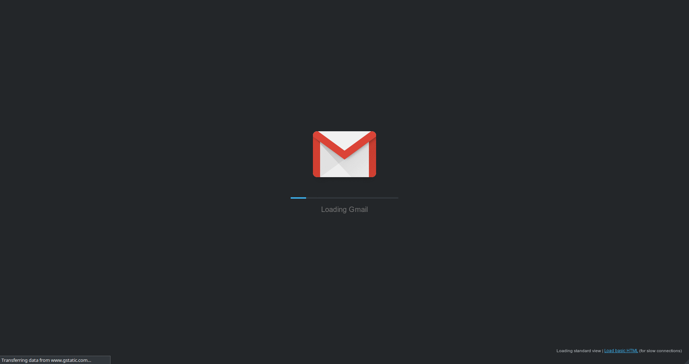
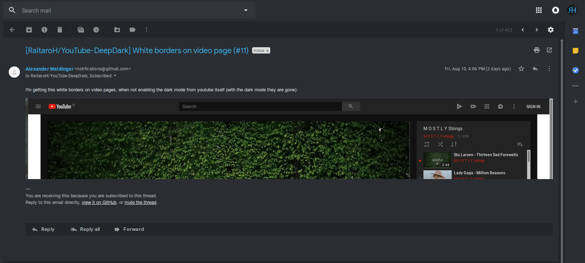

# Gmail-DeepDark

Emails should be written and read in the dark. May the dark be kinder on thine eyes. (Gmail dark theme)

### NOTE: This is for the new august 2018+ gmail.

This is a dark theme for Gmail inspired by FT DeepDark.

Also, credit where credit is due for the color palettes down bellow. ([@KDE](https://github.com/KDE), [@horst3180](https://github.com/horst3180), [@linuxmint](https://github.com/linuxmint), [Firefox](https://www.mozilla.org/en-US/firefox/new/), [YouTube](https://www.youtube.com/) and [Discord](https://discordapp.com/))

## Installing

#### Using a browser extension:
* Stylus - get the addon for [Firefox](https://addons.mozilla.org/en-US/firefox/addon/styl-us/), [Chrome](https://chrome.google.com/webstore/detail/stylus/clngdbkpkpeebahjckkjfobafhncgmne) and [Opera](https://addons.opera.com/en-gb/extensions/details/stylus/).
* This is only available using Stylus (see the [documentation](https://github.com/openstyles/stylus/wiki/Usercss)).
* Also see the documentation for information about customizing the theme. :tada:

### **You can also install all my themes at once from [here](https://gitlab.com/RaitaroH/Import-All-Deepdark).**

# Install and setup

### Using a browser extension:
* Stylus - get the addon for [Firefox](https://addons.mozilla.org/en-US/firefox/addon/styl-us/), [Chrome](https://chrome.google.com/webstore/detail/stylus/clngdbkpkpeebahjckkjfobafhncgmne) and [Opera](https://addons.opera.com/en-gb/extensions/details/stylus/).

### Install this theme:

  >Installs directly from this repository.
  >This is only available using Stylus (see the [documentation](https://github.com/openstyles/stylus/wiki/Usercss)). :tada:

# Screenshots

NOTE: The below images are using BreezeDark colors.

Other colors examples from my [Stylus-DeepDark](https://gitlab.com/RaitaroH/Stylus-DeepDark).

